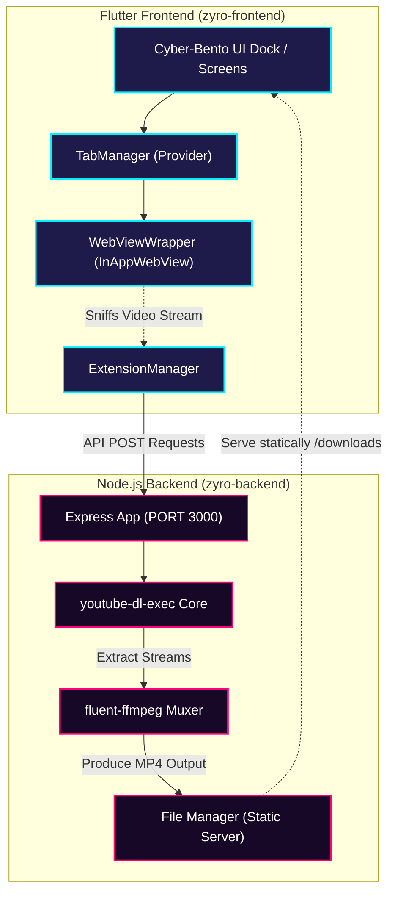

<div align="center">

<!-- ANIMATED 3D ISOMETRIC BANNER -->
<svg viewBox="0 0 850 380" xmlns="http://www.w3.org/2000/svg" style="background: #0B0E14; border-radius: 16px; box-shadow: 0 20px 50px rgba(0,0,0,0.5); font-family: 'Outfit', 'Inter', sans-serif;">
  <defs>
    <!-- Gradients -->
    <linearGradient id="neonCyan" x1="0%" y1="0%" x2="100%" y2="100%">
      <stop offset="0%" stop-color="#00F0FF" />
      <stop offset="100%" stop-color="#0072FF" />
    </linearGradient>
    <linearGradient id="neonMagenta" x1="0%" y1="0%" x2="100%" y2="100%">
      <stop offset="0%" stop-color="#FF007A" />
      <stop offset="100%" stop-color="#7900FF" />
    </linearGradient>
    <linearGradient id="gridGrad" x1="0%" y1="0%" x2="0%" y2="100%">
      <stop offset="0%" stop-color="#1E293B" stop-opacity="0.8"/>
      <stop offset="100%" stop-color="#0B0E14" stop-opacity="0.1"/>
    </linearGradient>
    <radialGradient id="radialGlow" cx="50%" cy="50%" r="50%">
      <stop offset="0%" stop-color="#00F0FF" stop-opacity="0.25" />
      <stop offset="100%" stop-color="#0B0E14" stop-opacity="0" />
    </radialGradient>
    <radialGradient id="magentaGlow" cx="50%" cy="50%" r="50%">
      <stop offset="0%" stop-color="#FF007A" stop-opacity="0.2" />
      <stop offset="100%" stop-color="#0B0E14" stop-opacity="0" />
    </radialGradient>

    <!-- Filters -->
    <filter id="neonFilter" x="-20%" y="-20%" width="140%" height="140%">
      <feGaussianBlur stdDeviation="6" result="blur" />
      <feMerge>
        <feMergeNode in="blur" />
        <feMergeNode in="SourceGraphic" />
      </feMerge>
    </filter>
    <filter id="softGlow" x="-50%" y="-50%" width="200%" height="200%">
      <feGaussianBlur stdDeviation="15" result="blur" />
      <feMerge>
        <feMergeNode in="blur" />
        <feMergeNode in="SourceGraphic" />
      </feMerge>
    </filter>
  </defs>

  <style>
    /* CSS Keyframe Animations */
    @keyframes pulse {
      0% { opacity: 0.3; }
      50% { opacity: 0.8; }
      100% { opacity: 0.3; }
    }
    @keyframes floatLayer {
      0% { transform: translateY(0px); }
      50% { transform: translateY(-8px); }
      100% { transform: translateY(0px); }
    }
    @keyframes floatLayerReverse {
      0% { transform: translateY(0px); }
      50% { transform: translateY(8px); }
      100% { transform: translateY(0px); }
    }
    @keyframes dashMove {
      to { stroke-dashoffset: -40; }
    }
    @keyframes rotateRing {
      0% { transform: rotate(0deg); }
      100% { transform: rotate(360deg); }
    }
    @keyframes textGlow {
      0%, 100% { filter: drop-shadow(0 0 2px rgba(0,240,255,0.6)); }
      50% { filter: drop-shadow(0 0 10px rgba(0,240,255,0.9)); }
    }
    
    .grid-lines {
      stroke: #1E293B;
      stroke-width: 1;
      opacity: 0.4;
    }
    .flow-line {
      stroke-dasharray: 8, 8;
      animation: dashMove 2s linear infinite;
    }
    .floating-ui {
      animation: floatLayer 6s ease-in-out infinite;
      transform-origin: center;
    }
    .floating-backend {
      animation: floatLayerReverse 6s ease-in-out infinite;
      transform-origin: center;
    }
    .neon-pulse {
      animation: pulse 3s ease-in-out infinite;
    }
    .brand-title {
      font-weight: 900;
      font-size: 44px;
      letter-spacing: 6px;
      fill: url(#neonCyan);
      animation: textGlow 4s ease-in-out infinite;
    }
    .brand-subtitle {
      font-size: 14px;
      font-weight: 500;
      letter-spacing: 4px;
      fill: #94A3B8;
    }
  </style>

  <!-- Background Grid -->
  <rect width="850" height="380" fill="#0B0E14" />
  <g opacity="0.6">
    <!-- Isometric Grid lines -->
    <path d="M-100,0 L950,525 M-100,50 L950,575 M-100,100 L950,625 M-100,150 L950,675 M-100,200 L950,725 M-100,250 L950,775 M-100,300 L950,825" stroke="#1E293B" stroke-width="1"/>
    <path d="M950,0 L-100,525 M950,50 L-100,575 M950,100 L-100,625 M950,150 L-100,675 M950,200 L-100,725 M950,250 L-100,775 M950,300 L-100,825" stroke="#1E293B" stroke-width="1"/>
  </g>

  <!-- Glow Backgrounds -->
  <circle cx="580" cy="190" r="160" fill="url(#radialGlow)" filter="url(#softGlow)" />
  <circle cx="250" cy="190" r="140" fill="url(#magentaGlow)" filter="url(#softGlow)" />

  <!-- Flow Lines (Data pathways between planes) -->
  <g stroke-width="1.5">
    <!-- Frontend to Backend flow -->
    <path d="M530,120 L530,240" stroke="url(#neonCyan)" class="flow-line" />
    <path d="M630,100 L630,220" stroke="url(#neonMagenta)" class="flow-line" style="animation-duration: 1.5s;" />
    <path d="M480,150 L480,260" stroke="#00F0FF" class="flow-line" style="animation-duration: 3s;" />
  </g>

  <!-- ISOMETRIC REPRESENTATIONS -->
  
  <!-- 1. Node.js Backend Isometric Layer (Lower) -->
  <g class="floating-backend" transform="translate(0, 15)">
    <!-- Base Plane -->
    <polygon points="400,260 680,190 780,240 500,310" fill="#111827" stroke="#374151" stroke-width="1.5" opacity="0.9" />
    <polygon points="400,260 680,190 780,240 500,310" fill="none" stroke="url(#neonMagenta)" stroke-width="1.5" opacity="0.6" filter="url(#neonFilter)" />
    
    <!-- Server Node 3D Box -->
    <g transform="translate(560, 215)">
      <!-- Top -->
      <polygon points="0,-20 40,-35 80,-20 40,-5" fill="#1F2937" stroke="#4B5563" />
      <!-- Left -->
      <polygon points="0,-20 40,-5 40,25 0,10" fill="#111827" stroke="#374151" />
      <!-- Right -->
      <polygon points="40,-5 80,-20 80,10 40,25" fill="#111827" stroke="#374151" />
      <!-- Glowing highlights -->
      <line x1="40" y1="-5" x2="40" y2="25" stroke="url(#neonMagenta)" stroke-width="1.5" />
      <circle cx="20" cy="-2" r="2" fill="#00F0FF" />
      <circle cx="40" cy="-8" r="2" fill="#FF007A" />
      <circle cx="60" cy="-14" r="2" fill="#00F0FF" />
    </g>
    <text x="610" y="270" fill="#94A3B8" font-size="10" font-weight="700" letter-spacing="1">FFMPEG &amp; YT-DL PIPELINE</text>
  </g>

  <!-- 2. Flutter UI Isometric Layer (Upper) -->
  <g class="floating-ui" transform="translate(0, -15)">
    <!-- Base Plane representing Browser Shell -->
    <polygon points="400,140 680,70 780,120 500,190" fill="rgba(17, 24, 39, 0.75)" stroke="#1F2937" stroke-width="2" style="backdrop-filter: blur(4px);" />
    <polygon points="400,140 680,70 780,120 500,190" fill="none" stroke="url(#neonCyan)" stroke-width="2" filter="url(#neonFilter)" />
    
    <!-- Bento Grid representation on top plane -->
    <!-- Tab 1 -->
    <polygon points="450,135 520,118 550,133 480,150" fill="rgba(0, 240, 255, 0.15)" stroke="url(#neonCyan)" stroke-width="1" />
    <!-- Dock / Bento Dock -->
    <polygon points="560,163 670,135 690,145 580,173" fill="rgba(255, 0, 122, 0.2)" stroke="url(#neonMagenta)" stroke-width="1.5" filter="url(#neonFilter)" />
    <!-- Dynamic HUD / Extension indicator -->
    <polygon points="620,105 680,90 700,100 640,115" fill="rgba(16, 185, 129, 0.15)" stroke="#10B981" stroke-width="1" />
    
    <!-- Isometric Floating Card (AdBlock Active UI) -->
    <g transform="translate(490, 80)">
      <polygon points="0,-10 40,-20 70,-5 30,5" fill="#1E1B4B" stroke="#4F46E5" stroke-width="1.5" />
      <polygon points="0,-10 40,-20 70,-5 30,5" fill="none" stroke="url(#neonCyan)" stroke-width="1" opacity="0.8" />
      <path d="M30,-12 L40,-5 L25,3" fill="none" stroke="#00F0FF" stroke-width="2" stroke-linecap="round" stroke-linejoin="round" />
    </g>
    <text x="630" y="70" fill="#94A3B8" font-size="10" font-weight="700" letter-spacing="1">CYBER-BENTO FLUTTER SHELL</text>
  </g>

  <!-- Left Side: Interactive Text & Branding -->
  <g transform="translate(60, 100)">
    <!-- Small Tag -->
    <rect width="125" height="22" rx="11" fill="#1E293B" stroke="#334155" />
    <circle cx="15" cy="11" r="4" fill="#00F0FF" class="neon-pulse" />
    <text x="28" y="15" fill="#38BDF8" font-size="10" font-weight="700" letter-spacing="1">NEXT-GEN BROWSER</text>

    <!-- Project Title -->
    <text x="0" y="70" class="brand-title">ZYRO</text>
    <text x="145" y="70" fill="#FFFFFF" font-size="44px" font-weight="200" letter-spacing="6px">BROWSER</text>
    
    <!-- Animated Horizontal Divider -->
    <line x1="0" y1="95" x2="310" y2="95" stroke="url(#cyberGrad)" stroke-width="2" stroke-linecap="round" />
    
    <!-- Detailed Feature List (Short Description) -->
    <text x="0" y="130" class="brand-subtitle">ADAPTIVE CORE</text>
    <text x="140" y="130" fill="#64748B" font-size="14px">|</text>
    <text x="160" y="130" class="brand-subtitle">CYBER-BENTO UI</text>
    <text x="0" y="155" class="brand-subtitle">ADBLOCK ENGINE</text>
    <text x="150" y="155" fill="#64748B" font-size="14px">|</text>
    <text x="170" y="155" class="brand-subtitle">VIDEO SNIFFER</text>
  </g>

  <!-- Bottom Details Bar -->
  <rect x="20" y="325" width="810" height="35" rx="8" fill="rgba(15, 23, 42, 0.8)" stroke="#1E293B" stroke-width="1" />
  <text x="40" y="347" fill="#64748B" font-size="10" font-weight="500" letter-spacing="1">MODULES: FLUTTER WORKSPACE &amp; NODE.JS EXTRACTOR</text>
  <text x="690" y="347" fill="#00F0FF" font-size="10" font-weight="700" letter-spacing="1">ACTIVE DEVELOPMENT</text>
  <circle cx="680" cy="344" r="3" fill="#00F0FF" class="neon-pulse" />
</svg>

<br/>

[](https://flutter.dev)
[](https://nodejs.org)
[](https://expressjs.com)
[](https://ffmpeg.org)
[](https://opensource.org/licenses/MIT)

<h3>Zyro Browser is a high-performance web browser styled around a futuristic Cyber-Bento design. Featuring a decentralized extension engine, system-level content blockers, and an adaptive video extraction system powered by a companion Node.js backend.</h3>

[Explore Frontend](file:///d:/zyro/zyro-frontend) • [Explore Backend](file:///d:/zyro/zyro-backend) • [View Architecture](#-architecture-overview)

---
</div>

## 🌌 Key Highlights

- **Cyber-Bento UI Language**: A design pattern leveraging premium glassmorphism, depth-based layout, and a floating **Bento Dock** navigation unit at the bottom of the screen.
- **Dynamic Extension Registry**: Built-in Sandboxed Extension Engine supporting run-time script execution and rule injection.
- **Pre-installed Ad-Blocker**: Multi-layer blocking mechanism integrating custom webview content rules and CSS/JS script blockers.
- **Companion Downloader Pipeline**: Integrates a background Node.js media server that sniff-extracts video URLs and muxes video/audio streams on-the-fly via FFmpeg.

---

## 🧭 Architecture Overview

The system is split into two specialized workspaces: a high-fidelity **Flutter Mobile Client** and a high-performance **Node.js/FFmpeg Microservice**.



---

## 📦 Project Structure

### 📱 [Frontend - zyro-frontend](file:///d:/zyro/zyro-frontend)
Contains the Flutter application logic:
*   [lib/core/](file:///d:/zyro/zyro-frontend/lib/core): Core infrastructure classes.
    *   [tab_manager.dart](file:///d:/zyro/zyro-frontend/lib/core/tab_manager.dart): Multiplexes browser tabs using a state provider.
    *   [webview_wrapper.dart](file:///d:/zyro/zyro-frontend/lib/core/webview_wrapper.dart): Tailors web viewport features and links JavaScript channels.
    *   [extension_manager.dart](file:///d:/zyro/zyro-frontend/lib/core/extension_manager.dart): Oversees external scripts and manages adblocking filters.
    *   [browser_data_manager.dart](file:///d:/zyro/zyro-frontend/lib/core/browser_data_manager.dart): Stores History, Bookmarks, and Downloads local databases.
*   [lib/app/](file:///d:/zyro/zyro-frontend/lib/app): Interface views and design modules.
    *   `screens/`: Dashboard sheets for Browser, History, Bookmarks, and Extensions panel.
    *   `widgets/`: Cyber-Bento styling containers, neon elements, dynamic indicators.
*   [lib/features/](file:///d:/zyro/zyro-frontend/lib/features): Subsystems including media player widgets and download status handlers.

### ⚙️ [Backend - zyro-backend](file:///d:/zyro/zyro-backend)
Provides media parsing services:
*   [src/server.js](file:///d:/zyro/zyro-backend/src/server.js): Root setup configuration, serving assets and routing API controllers.
*   [src/routes/](file:///d:/zyro/zyro-backend/src/routes): Mapping routes for requests:
    *   `POST /api/video/metadata`: Resolves page source to retrieve details (Thumbnails, Audio/Video Streams).
    *   `POST /api/video/download`: Dispatches background download pipeline worker.
    *   `GET /api/video/status/:taskId`: Returns download status, transfer rate, and percentage.
*   [src/services/](file:///d:/zyro/zyro-backend/src/services): Interacts with stream parsing binaries and file paths.

---

## 🚀 Installation & Running

Follow these instructions to run the frontend and backend instances locally.

### 1️⃣ Run Backend Microservice

Ensure you have **Node.js (v18+)** and **FFmpeg** installed on your system.

```bash
# Navigate to backend directory
cd zyro-backend

# Install package dependencies
npm install

# Run backend on Development mode (Default port: 3000)
npm run dev
```

### 2️⃣ Run Flutter Frontend

Verify you have configured the **Flutter SDK (3.x)** and an Android Emulator, iOS Simulator, or Desktop configuration is active.

```bash
# Navigate to frontend directory
cd ../zyro-frontend

# Retrieve flutter package imports
flutter pub get

# Run on the default connected device
flutter run
```

---

## 🛠️ Tech Stack & Dependencies

### Frontend (`zyro-frontend`)
*   **Core UI Engine**: Flutter Framework
*   **Webview Substrate**: `flutter_inappwebview`
*   **State Management**: `provider`
*   **Design Tokens**: `google_fonts` (Outfit / Inter) & `lucide_icons`

### Backend (`zyro-backend`)
*   **Server Framework**: Express / Node.js
*   **Extraction Core**: `youtube-dl-exec`
*   **Transcoding Pipeline**: `fluent-ffmpeg`
*   **File Distribution**: Static Asset Hosting via Express

---

<div align="center">
  <sub>Created &amp; Optimized with 🌐 &amp; 🧬 by Antigravity</sub>
</div>
