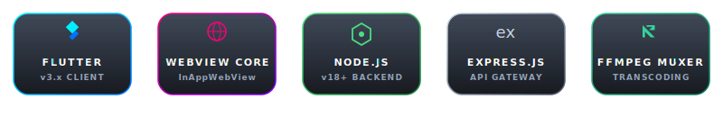

# 🌐 Zyro Browser

<p align="center">
  
</p>

<p align="center">
  
</p>

<p align="center">
  <a href="#-overview">Overview</a> •
  <a href="#-feature-matrix">Features</a> •
  <a href="#-architecture-overview">Architecture</a> •
  <a href="#-project-structure">Structure</a> •
  <a href="#-installation--running">Installation</a> •
  <a href="#-platform-channels">Platform Channels</a> •
  <a href="#-developer">Developer</a>
</p>

<p align="center">
  
  
  
  
  
</p>

---

## 🌌 Overview

**Zyro Browser** is a premium, high-performance mobile web browser for Android built with Flutter, featuring a futuristic **Cyber-Bento** design language. It combines a high-fidelity Flutter client with a dedicated Node.js/FFmpeg media microservice — offering native ad blocking, smart video download, background audio playback, home screen web app installation, per-site permission management, full-page screenshot capture with PDF export, and a sandboxed extension ecosystem.

> ✨ Zyro is not a WebView wrapper with a thin UI shell. It is a **complete, vertically integrated browser stack** — from the Android foreground service layer through the Flutter extension engine to the Node.js stream extraction pipeline.

---

## 🚀 Why Zyro Browser?

| Capability | Description |
|---|---|
| 🎨 **Cyber-Bento Design** | Glassmorphic, futuristic UI with Outfit typography and a deep indigo/teal/cyan palette |
| 🛡️ **Native Ad Blocking** | Multi-layer request interceptor with 35+ rules blocking ads, trackers, beacons, and popunders |
| 📊 **Ad Block Analytics** | Persistent per-domain blocked-request counters with daily reset and lifetime totals |
| 🎵 **Background Playback** | Uninterrupted audio/video via Android `MediaSession` foreground service with lock-screen controls |
| 🎬 **Smart Video Detection** | JavaScript-based detection across YouTube, Vimeo, Facebook, Instagram, Twitter/X, Dailymotion |
| 📥 **Media Download Pipeline** | yt-dlp metadata extraction → adaptive stream download → FFmpeg merge → static file hosting |
| 📸 **Screenshot Pro** | Floating capture button with viewport screenshot, full-page scrolling stitch, PNG save, A4 PDF export |
| 📱 **Web App Installer** | Install any website as an Android home screen shortcut with manifest parsing and shortcut lifecycle sync |
| 🔐 **Website Permissions** | Per-site allow/ask/block controls for Camera, Microphone, Location, Notifications, and Clipboard |
| 🔌 **Extension Ecosystem** | Sandboxed extension registry with install/uninstall/enable/disable lifecycle and persistent state |
| 🗂️ **Tab Groups** | Full grouped tab management alongside standalone tabs with session persistence |
| 🕵️ **Incognito Mode** | Global incognito mode with dedicated theme and session isolation |
| 🛠️ **Dev Tools Extension** | Built-in element inspector, console viewer, network logger, and storage explorer |

---

## ✨ Feature Matrix

<details>
<summary><strong>🧭 Browser Core</strong></summary>

| Feature | Status |
|---|---|
| `flutter_inappwebview`-powered WebView | ✅ Implemented |
| Multi-tab management (standalone + grouped) | ✅ Implemented |
| Tab session persistence across restarts | ✅ Implemented |
| Tab groups with color labels | ✅ Implemented |
| Incognito mode (global toggle) | ✅ Implemented |
| Undo tab close (5-second window) | ✅ Implemented |
| Desktop mode per tab | ✅ Implemented |
| Find-in-page | ✅ Implemented |
| Smart address bar (search vs. URL routing) | ✅ Implemented |
| Popup window / new tab handling | ✅ Implemented |
| History tracking | ✅ Implemented |
| Bookmark system | ✅ Implemented |
| Reading list | ✅ Implemented (in-memory only) |
| Favorites | ✅ Implemented (in-memory only) |
| Share page | ✅ Implemented (`share_plus`) |

</details>

<details>
<summary><strong>🛡️ Ad Blocker</strong></summary>

| Feature | Status |
|---|---|
| URL-pattern request interception (35+ rules) | ✅ Implemented |
| Tracker / beacon / analytics blocking | ✅ Implemented |
| Google Ads / DoubleClick / Syndication blocking | ✅ Implemented |
| Facebook pixel / GTM / Google Analytics blocking | ✅ Implemented |
| AppNexus, PubMatic, Criteo, Taboola, Outbrain | ✅ Implemented |
| Pop-under / pop-up blocking | ✅ Implemented |
| YouTube ad cosmetic injection | ✅ Implemented |
| Generic cosmetic filter injection | ✅ Implemented |
| Per-domain blocked-request analytics | ✅ Implemented |
| Today-blocked counter with daily reset | ✅ Implemented |
| Lifetime total blocked counter | ✅ Implemented |
| Ad block analytics dashboard (Settings UI) | ✅ Implemented |
| Toggle ad blocker per extension | ✅ Implemented |

</details>

<details>
<summary><strong>📸 Screenshot Pro</strong></summary>

| Feature | Status |
|---|---|
| Floating screenshot FAB on browser | ✅ Implemented |
| Visible viewport screenshot | ✅ Implemented |
| Full-page scrolling stitch capture (max 16000px height) | ✅ Implemented |
| Scroll-behavior override during capture | ✅ Implemented |
| Scroll-position restoration after capture | ✅ Implemented |
| PNG save to device storage (screenshots subfolder) | ✅ Implemented |
| Multi-page A4 PDF export | ✅ Implemented |
| Native WebView PDF export via `zyro/screenshot_pro` channel | ✅ Implemented |
| Progress dialog during capture | ✅ Implemented |
| Persistent enable/disable toggle | ✅ Implemented |

</details>

<details>
<summary><strong>📱 Web App Installer</strong></summary>

| Feature | Status |
|---|---|
| Web App Manifest detection from DOM | ✅ Implemented |
| Manifest icon download & local caching | ✅ Implemented |
| Bitmap decode + normalization (blank/too-small fallback) | ✅ Implemented |
| Android home screen shortcut pinning (API 26+) | ✅ Implemented |
| Shortcut intent routing back to browser | ✅ Implemented |
| Shortcut URL validation (http/https only) | ✅ Implemented |
| Installed app list (Zyro Apps) | ✅ Implemented |
| Pinned shortcut ID synchronization | ✅ Implemented |
| Shortcut launch handling on cold start | ✅ Implemented |
| Shortcut launch handling on warm resume | ✅ Implemented |

</details>

<details>
<summary><strong>🔐 Website Permissions Manager</strong></summary>

| Permission | Status |
|---|---|
| Camera | ✅ Implemented |
| Microphone | ✅ Implemented |
| Location (`locationWhenInUse`) | ✅ Implemented |
| Notifications | ✅ Implemented |
| Clipboard (read) | ✅ Implemented |
| Allow / Ask every time / Block per domain | ✅ Implemented |
| Persistent storage via `SharedPreferences` | ✅ Implemented |
| Android runtime permission escalation | ✅ Implemented |
| Per-site permission management UI | ✅ Implemented |
| Per-permission category browser | ✅ Implemented |

</details>

<details>
<summary><strong>🎵 Background Media Playback</strong></summary>

| Feature | Status |
|---|---|
| Android foreground service (`startForegroundService`) | ✅ Implemented |
| `MediaSession` with transport controls | ✅ Implemented |
| Lock-screen play / pause / next / previous | ✅ Implemented |
| Seek via lock-screen progress bar | ✅ Implemented |
| `PARTIAL_WAKE_LOCK` (30 min) | ✅ Implemented |
| Notification channel (Importance: Low, no badge) | ✅ Implemented |
| Media state sync (title, website, duration, position) | ✅ Implemented |
| JavaScript bridge: play/pause/next/prev/seek | ✅ Implemented |
| Background player extension toggle | ✅ Implemented |
| Service auto-stop on tab close | ✅ Implemented |

</details>

<details>
<summary><strong>📥 Video Download Engine</strong></summary>

| Feature | Status |
|---|---|
| Real-time video detection via JavaScript DOM polling | ✅ Implemented |
| YouTube, Vimeo, Facebook, Instagram, Twitter/X, Dailymotion | ✅ Implemented |
| Direct `.mp4`, `.mkv`, `.webm` URL detection | ✅ Implemented |
| yt-dlp metadata extraction (`youtube-dl-exec`) | ✅ Implemented |
| Adaptive format selection (separate video + audio) | ✅ Implemented |
| Progressive stream detection (video+audio combined) | ✅ Implemented |
| FFmpeg video+audio stream merge | ✅ Implemented |
| FFmpeg audio-only → 320kbps MP3 conversion | ✅ Implemented |
| Background download task with UUID tracking | ✅ Implemented |
| Real-time task status polling | ✅ Implemented |
| Playlist download rejection | ✅ Implemented |
| Floating download HUD | ✅ Implemented |
| Quality selector bottom sheet | ✅ Implemented |
| Download library screen | ✅ Implemented |
| Video height validation after download | ✅ Implemented |
| URL sanitizer (strips tracking params) | ✅ Implemented |
| Android `DownloadManager` integration | ✅ Implemented |
| MediaStore device storage save | ✅ Implemented |
| Local in-app video player | ✅ Implemented |

</details>

<details>
<summary><strong>🔌 Extension Ecosystem</strong></summary>

| Extension | ID | Default State |
|---|---|---|
| Ad Blocker & Downloader | `ad_blocker_downloader` | Installed + Enabled |
| Dev Tools | `dev_tools` | Installed, Disabled |
| Background Player | `background_player` | Installed, Disabled |
| Dark Reader | `dark_mode` | Available (not installed) |
| KeyGen | `password_gen` | Available (not installed) |

</details>

---

## 🧭 Architecture Overview

<p align="center">
  
</p>

*✨ Live data-flow animation — glowing dots travel the connector lines to show requests, messages, and files moving through the system in real time.*

### High-Level System Layers

```
┌──────────────────────────────────────────────────────────────────────┐
│                         Android Device                               │
│                                                                      │
│  ┌─────────────────── Flutter Application ───────────────────────┐  │
│  │                                                               │  │
│  │   Cyber-Bento UI         Extension Engine                     │  │
│  │   (Widgets/Screens)      (AdBlock, BG Player, Dev Tools)      │  │
│  │                                                               │  │
│  │   ─────────────────── Core Layer ─────────────────────────   │  │
│  │   TabManager │ WebViewWrapper │ BrowserDataManager            │  │
│  │   ExtensionManager │ ScriptEngine                             │  │
│  │                                                               │  │
│  │   ──────────────── Feature Modules ────────────────────────  │  │
│  │   Screenshot Pro │ Web Apps │ Permissions                     │  │
│  │   Video Downloader │ Download Library │ Settings              │  │
│  └──────────────────────────┬────────────────────────────────────┘  │
│                             │ MethodChannels                         │
│  ┌──────────────────────────▼────────────────────────────────────┐  │
│  │            Native Kotlin (MainActivity.kt)                    │  │
│  │  zyro/downloads │ zyro/screenshot_pro                         │  │
│  │  zyro/web_apps  │ zyro/background_player                      │  │
│  └────────────────────────────┬──────────────────────────────────┘  │
│                               │                                      │
│  ┌────────────────────────────▼──────────────────────────────────┐  │
│  │     BackgroundPlayerService.kt (Android Foreground Service)   │  │
│  │     MediaSession │ WakeLock │ NotificationChannel             │  │
│  └───────────────────────────────────────────────────────────────┘  │
└──────────────────────────────────────────────────────────────────────┘
                    │ HTTP (localhost:3000)
┌───────────────────▼──────────────────────────────────────────────────┐
│                   Node.js Media Microservice                         │
│  Express  │  youtube-dl-exec (yt-dlp)  │  fluent-ffmpeg  │  uuid    │
│                                                                      │
│  POST /api/video/metadata  → VideoExtractor → yt-dlp                │
│  POST /api/video/download  → FormatSelector → DownloadManager        │
│                            → MergeService (FFmpeg)                  │
│  GET  /api/video/status/:id → Task state polling                    │
│  GET  /downloads/:file     → Static file serving                    │
└──────────────────────────────────────────────────────────────────────┘
```

---

## 📦 Project Structure

```text
zyro/
│
├── 📱 zyro-frontend/                     Flutter Android application
│   ├── lib/
│   │   ├── main.dart                     App entry; MultiProvider setup
│   │   ├── core/
│   │   │   ├── tab_manager.dart          Multi-tab + group session manager
│   │   │   ├── webview_wrapper.dart      WebView config, JS bridge, intercepts
│   │   │   ├── extension_manager.dart    Extension registry + lifecycle
│   │   │   ├── browser_data_manager.dart History, bookmarks, downloads, DL polling
│   │   │   ├── globals.dart              Global navigator/scaffold keys
│   │   │   ├── constants/app_assets.dart Asset path constants
│   │   │   ├── models/
│   │   │   │   ├── tab_model.dart        Tab state (url, title, favicon, scroll...)
│   │   │   │   ├── extension_model.dart  Extension definition + lifecycle state
│   │   │   │   ├── bookmark_item.dart
│   │   │   │   ├── history_item.dart
│   │   │   │   ├── download_item.dart
│   │   │   │   └── link_metadata.dart    Long-press link context model
│   │   │   ├── services/
│   │   │   │   ├── tab_session_storage_service.dart
│   │   │   │   ├── extension_storage_service.dart
│   │   │   │   └── extension_notification_service.dart
│   │   │   └── theme/
│   │   │       ├── app_colors.dart       Color palette (light/dark)
│   │   │       ├── app_theme.dart        MaterialApp themes
│   │   │       ├── theme_controller.dart
│   │   │       └── theme_storage_service.dart
│   │   ├── engine/
│   │   │   ├── hooks.dart                BrowserHooks interface
│   │   │   └── script_engine.dart        JS injection coordinator
│   │   ├── app/
│   │   │   ├── screens/
│   │   │   │   ├── browser_main.dart     Main browser scaffold
│   │   │   │   ├── tab_switcher.dart     Tab manager UI + groups
│   │   │   │   ├── history_screen.dart
│   │   │   │   ├── bookmarks_screen.dart
│   │   │   │   ├── extensions_screen.dart
│   │   │   │   └── local_video_player_screen.dart
│   │   │   └── widgets/
│   │   │       ├── cyber_menu.dart       Cyber-Bento navigation drawer
│   │   │       ├── glass_app_bar.dart    Glassmorphic URL/search bar
│   │   │       ├── glass_container.dart
│   │   │       └── link_context_menu_sheet.dart
│   │   └── features/
│   │       ├── splash/screens/splash_screen.dart
│   │       ├── screenshot_pro/
│   │       │   ├── controllers/screenshot_pro_controller.dart
│   │       │   ├── models/screenshot_capture_result.dart
│   │       │   ├── services/
│   │       │   │   ├── screenshot_capture_service.dart    (viewport PNG)
│   │       │   │   ├── full_page_capture_service.dart     (scroll stitch)
│   │       │   │   ├── screenshot_pdf_export_service.dart (A4 PDF export)
│   │       │   │   ├── pdf_export_service.dart
│   │       │   │   └── screenshot_pro_settings_service.dart
│   │       │   ├── screens/screenshot_pro_sheet.dart
│   │       │   └── widgets/
│   │       │       ├── screenshot_floating_button.dart
│   │       │       ├── screenshot_options_sheet.dart
│   │       │       ├── screenshot_option_tile.dart
│   │       │       └── capture_progress_dialog.dart
│   │       ├── web_apps/
│   │       │   ├── controllers/web_app_installer_controller.dart
│   │       │   └── services/web_app_shortcut_channel.dart
│   │       ├── permissions/
│   │       │   ├── controllers/website_permissions_controller.dart
│   │       │   ├── models/
│   │       │   │   ├── permission_enums.dart
│   │       │   │   └── website_permission_rule.dart
│   │       │   ├── services/
│   │       │   │   ├── website_permission_manager.dart
│   │       │   │   ├── website_permission_storage_service.dart
│   │       │   │   └── domain_normalizer.dart
│   │       │   ├── screens/
│   │       │   │   ├── website_permissions_screen.dart
│   │       │   │   └── permission_category_screen.dart
│   │       │   └── widgets/
│   │       │       ├── permission_request_dialog.dart
│   │       │       ├── permission_site_tile.dart
│   │       │       ├── permission_status_selector.dart
│   │       │       └── permission_summary_card.dart
│   │       ├── extensions/
│   │       │   ├── ad_blocker/
│   │       │   │   ├── models/ad_block_stats_model.dart
│   │       │   │   ├── services/
│   │       │   │   │   ├── ad_block_service.dart
│   │       │   │   │   ├── ad_block_rule_engine.dart     (35+ regex rules)
│   │       │   │   │   ├── ad_block_stats_service.dart   (analytics)
│   │       │   │   │   ├── youtube_ad_blocker_service.dart
│   │       │   │   │   └── cosmetic_filter_injector.dart
│   │       │   │   └── widgets/ad_block_settings_stats_widget.dart
│   │       │   ├── background_player/
│   │       │   │   ├── background_player_service.dart
│   │       │   │   └── platform/background_player_channel.dart
│   │       │   ├── dev_tools/
│   │       │   │   ├── dev_tools_controller.dart
│   │       │   │   ├── dev_tools_extension.dart
│   │       │   │   ├── dev_tools_models.dart
│   │       │   │   ├── dev_tools_service.dart
│   │       │   │   └── widgets/
│   │       │   ├── floating_videos/      [Scaffolded — not yet implemented]
│   │       │   └── widgets/extension_overview_dialog.dart
│   │       ├── video_downloader/
│   │       │   ├── controllers/download_controller.dart
│   │       │   ├── models/
│   │       │   │   ├── current_playing_video.dart
│   │       │   │   ├── download_request.dart
│   │       │   │   ├── downloaded_video.dart
│   │       │   │   └── video_format.dart
│   │       │   ├── services/
│   │       │   │   ├── video_detection_service.dart
│   │       │   │   ├── download_api_service.dart
│   │       │   │   ├── format_mapper_service.dart
│   │       │   │   ├── local_storage_service.dart
│   │       │   │   ├── media_store_service.dart
│   │       │   │   └── url_sanitizer_service.dart
│   │       │   └── widgets/
│   │       │       ├── floating_download_button.dart
│   │       │       └── quality_selector_sheet.dart
│   │       ├── download_library/screens/downloads_screen.dart
│   │       ├── video_player/screens/
│   │       └── settings/screens/
│   │           ├── settings_screen.dart
│   │           └── developer_info_screen.dart
│   ├── assets/logo.png
│   └── android/app/src/main/kotlin/com/example/zyro/
│       ├── MainActivity.kt               Platform channel hub
│       ├── BackgroundPlayerService.kt    Android foreground media service
│       └── BackgroundPlayerConfirmActivity.kt
│
└── ⚙️ zyro-backend/                      Node.js media microservice
    ├── src/
    │   ├── server.js                     Express entry (port 3000)
    │   ├── routes/download.routes.js
    │   ├── controllers/download.controller.js
    │   ├── services/
    │   │   ├── videoExtractor.service.js (yt-dlp metadata extraction)
    │   │   ├── formatSelector.service.js (adaptive format selection)
    │   │   ├── downloadManager.service.js (stream download executor)
    │   │   ├── merge.service.js          (FFmpeg merge + MP3 conversion)
    │   │   ├── fileManager.service.js    (paths, dirs, verification)
    │   │   └── urlSanitizer.service.js   (URL cleaning)
    │   └── middleware/errorHandler.js
    ├── downloads/                        Completed files (static)
    ├── temp/                             FFmpeg workspace
    └── package.json
```

---

## 🏗️ Flutter Architecture

Zyro follows a **feature-first, provider-driven** architecture:

```
main.dart → MultiProvider → ZyroApp → SplashScreen → BrowserMainScreen
                │
                ├── ThemeController           theme mode persistence
                ├── TabManager                tabs + groups + session
                ├── BrowserDataManager        history, bookmarks, downloads
                ├── ExtensionManager          extension registry + lifecycle
                ├── DownloadController        download state + polling
                ├── DevToolsController        dev tools state
                ├── AdBlockStatsService       ad block analytics
                ├── ScreenshotProController   screenshot enable/expand state
                ├── WebAppInstallerController installed apps + shortcut sync
                └── WebsitePermissionsController per-site permission rules
```

**State Management:** Flutter `Provider` / `ChangeNotifier` throughout.
**Persistence:** `SharedPreferences` for all state (tabs, extensions, theme, permissions, ad block stats, screenshot settings, web apps).
**Navigation:** Named `navigatorKey` with `globalScaffoldKey` for cross-context snackbar delivery.
**Font:** Outfit (Google Fonts) via `GoogleFonts.outfit()`.
**Icons:** `lucide_icons` for consistent iconography.

---

## 📡 Platform Channels

All Flutter↔Android communication is via `MethodChannel` in `MainActivity.kt`:

| Channel | Direction | Methods |
|---|---|---|
| `zyro/downloads` | Flutter→Native | `enqueueDownload`, `queryDownload` |
| `zyro/screenshot_pro` | Flutter→Native | `exportWebViewPdf` |
| `zyro/web_apps` | Bidirectional | `pinWebAppShortcut`, `getPinnedShortcutIds`, `getInitialShortcutUrl` ↙ `webAppShortcutLaunched` |
| `zyro/background_player` | Bidirectional | `startService`, `updateState`, `stopService` ↙ `play`, `pause`, `next`, `previous`, `seekTo` |

---

## 🎨 Cyber-Bento UI System

### Design Tokens

| Token | Light | Dark |
|---|---|---|
| Background | `#F8FAFC` | `#0B0F19` |
| Surface | `#F1F5F9` | `#161F30` |
| Card | `#FFFFFF` | `#1E293B` |
| Primary | `#4F46E5` Indigo | `#6366F1` Indigo |
| Secondary | `#0D9488` Teal | `#14B8A6` Teal |
| Accent | `#06B6D4` Cyan | `#22D3EE` Cyan |
| Danger | `#EF4444` | `#EF4444` |

### Key UI Components

| Component | Description |
|---|---|
| `GlassAppBar` | Glassmorphic address/search bar with smart URL/search routing |
| `CyberMenu` | Slide-out Bento navigation drawer with logo, quick actions, and nav links |
| `GlassContainer` | Reusable frosted-glass surface primitive |
| `TabSwitcherScreen` | Full-screen tab manager with group support and undo close |
| `LinkContextMenuSheet` | Long-press sheet: open, new tab, copy, share, download, inspect |
| `FloatingDownloadButton` | Animated FAB shown when a downloadable video is detected |
| `ScreenshotFloatingButton` | Expandable FAB with mini-actions for viewport and full-page capture |
| `QualitySelectorSheet` | Format/quality picker bottom sheet for video downloads |

### Themes

- **Light Theme** — Clean white/slate with indigo primary accents
- **Dark Theme** — Deep navy/slate with indigo/teal/cyan neon accents
- **Incognito Theme** — Forced dark mode with session isolation

---

## ⚙️ Node.js Backend Architecture

### API Endpoints

| Method | Endpoint | Description |
|---|---|---|
| `POST` | `/api/video/metadata` | Extract video metadata + format list via yt-dlp |
| `POST` | `/api/video/download` | Start async download task; returns `taskId` |
| `GET` | `/api/video/status/:taskId` | Poll task state and progress |
| `GET` | `/downloads/:filename` | Serve completed media file statically |
| `GET` | `/` | Health check |

### Download Task State Machine

```
extracting → downloading_video → downloading_audio → merging → completed
                                                             ↘ failed
```

### FFmpeg Workflows

| Mode | Input | Operation | Output |
|---|---|---|---|
| **Video + Audio** | Separate adaptive streams | `-c:v copy -c:a aac -shortest` | `.mp4` / `.webm` |
| **Audio Only** | Audio stream | `-acodec libmp3lame -ab 320k` | `.mp3` |
| **Progressive** | Single stream (video+audio) | Direct download, no FFmpeg | `.mp4` |

---

## 📸 Screenshot Pro Workflow

```
User taps Screenshot FAB
        │
        ├──▶ Viewport Screenshot
        │       controller.takeScreenshot() → PNG bytes
        │       MediaStoreService.getSaveDirectoryPath('screenshots')
        │       File.writeAsBytes() → SnackBar notification
        │
        └──▶ Full Page Capture
                ├── Save current scrollY
                ├── Inject scroll-behavior:auto style override
                ├── Calculate scroll positions (viewport-step increments)
                ├── For each offset: scroll → wait 420ms → takeScreenshot()
                ├── img.decodePng() → stitch: img.copyCrop() + compositeImage()
                ├── Restore scrollY + remove style override
                └── Save stitched PNG
                          │
                          └──▶ PDF Export (optional)
                                  ├── Calculate A4 printable area + scale
                                  ├── Slice image into page-height strips
                                  ├── pw.Document().addPage() per strip
                                  └── File.writeAsBytes(pdf.save())
```

---

## 📱 Web App Installation Workflow

```
Page load → WebAppInstallerController detects manifest
        ├── Fetch <link rel="manifest"> via JS evaluation
        ├── HTTP GET manifest.json → parse name, icons, start_url, scope
        ├── Select best icon → HTTP download → local file cache
        └── Bitmap decode + normalize (blank/too-small detection)

User taps "Add to Home Screen"
        └── zyro/web_apps → pinWebAppShortcut(id, name, url, iconPath)
                └── MainActivity.kt:
                        ├── ShortcutManager.isRequestPinShortcutSupported
                        ├── BitmapFactory.decodeFile(iconPath)
                        ├── normalizeShortcutBitmap() — resize + round-rect clip
                        ├── ShortcutInfo.Builder → setIntent(openWebAppAction)
                        └── ShortcutManager.requestPinShortcut()

Shortcut tap on home screen
        └── MainActivity.onCreate / onNewIntent
                ├── handleWebAppShortcutIntent() → extract web_app_url
                ├── pendingWebAppUrl cached until Flutter engine ready
                └── webAppChannel.invokeMethod("webAppShortcutLaunched", {url})
                          └── WebAppShortcutLaunchBridge → TabManager.openUrl()
```

---

## 🛡️ Ad Blocker Architecture

```
WebView shouldInterceptRequest(url)
        └── AdBlockService.interceptRequest(url, requestType, sourceUrl)
                ├── [extension disabled] → return null (allow)
                └── AdBlockRuleEngine.match(url)
                        ├── Normalize to lowercase; extract sourceDomain
                        ├── Iterate 35+ compiled RegExp rules
                        ├── [matched] → AdBlockStatsService.recordBlockedEvent(url)
                        │       ├── domainBlockedCounts[domain]++
                        │       ├── totalBlocked++ / todayBlocked++
                        │       └── SharedPreferences save (async)
                        └── [not matched] → return null (allow)

WebView onPageStarted / onPageFinished / onUrlChanged
        └── ScriptEngine → AdBlockService.getInjectedScripts(url)
                ├── [youtube.com] → YouTubeAdBlockerService.cosmeticScript
                └── [other] → CosmeticFilterInjector.cosmeticScript
```

---

## 🎵 Background Media Playback Architecture

```
Flutter BackgroundPlayerService.dart
        └── BackgroundPlayerChannel → zyro/background_player → startService
                └── BackgroundPlayerService.kt (Android)
                        ├── PowerManager.WakeLock (30 min, PARTIAL_WAKE_LOCK)
                        ├── NotificationChannel (IMPORTANCE_LOW)
                        └── MediaSession("ZyroMediaSession")
                                ├── setMetadata(title, website, duration)
                                ├── setPlaybackState(position)
                                └── Callback: onPlay/onPause/onNext/onPrev/onSeekTo
                                        → onMediaAction → invokeMethod → Flutter
                                                → JS: media.play() / media.pause() /
                                                  nextBtn.click() / media.currentTime
```

---

## 🎬 Video Download Pipeline

```
VideoDetectionService.detectionScript → DOM polls <video> elements
        └── videoDetected event → Flutter → FloatingDownloadButton appears

User ▼ → QualitySelectorSheet → selects format + mode

DownloadController → POST /api/video/download
        └── Node.js:
                ├── yt-dlp: extractMetadata(url) → formats[]
                ├── formatSelector.selectFormats(formatId, mode)
                ├── [audio]      downloadStream → convertToMp3 (FFmpeg)
                ├── [progressive] downloadStream (no merge)
                └── [adaptive]   downloadStream(video) + downloadStream(audio)
                                 → mergeStreams (FFmpeg)
                                 → verifyVideoHeight()
        ▼ task.state = 'completed'
Flutter polls GET /api/video/status/:taskId
        └── BrowserDataManager → zyro/downloads → Android DownloadManager → MediaStore
```

---

## 🔐 Website Permissions Architecture

```
WebViewWrapper onPermissionRequest(origin, resources[])
        └── WebsitePermissionManager.resolve(context, origin, permissionType)
                ├── DomainNormalizer.normalize(origin) → domain
                ├── WebsitePermissionsController.ruleFor(domain, type)
                ├── [block] → return false (deny silently)
                ├── [allow] → requestAndroidPermission → return result
                └── [null/ask] → PermissionRequestDialog.show()
                        └── User: Allow / Ask / Block
                                → WebsitePermissionsController.upsert(rule)
                                → SharedPreferences
                                → requestAndroidPermission(type)
```

---

## 🔧 Browser Engine Details

| Setting | Value |
|---|---|
| Engine | `flutter_inappwebview` v6.1.5 |
| JavaScript | Enabled |
| JS Handlers | `videoStateUpdate`, `mediaProgress`, `devToolsLog` |
| Request Interception | `shouldOverrideUrlLoading` + `shouldInterceptRequest` |
| Page Lifecycle Hooks | `onPageStarted`, `onProgressChanged`, `onPageFinished`, `onUpdateVisitedHistory` |
| Popup Handling | `onCreateWindow` → new tab |
| Permission Handling | `onPermissionRequest` → WebsitePermissionManager |
| Context Menu | `onContextMenuActionItemClicked` → LinkContextMenuSheet |
| User Agent | Default; per-tab desktop mode toggle |

---

## 🚀 Installation & Running

### Prerequisites

| Requirement | Version |
|---|---|
| Flutter SDK | `^3.10` (Dart `^3.10.7`) |
| Android SDK | minSdk 21, targetSdk 34+ |
| Node.js | `18+` |
| FFmpeg | Latest stable — **must be on system `PATH`** |
| yt-dlp | Auto-installed via `youtube-dl-exec` npm package |
| Device | Android physical/emulator with USB Debugging |

### 1️⃣ Clone the Repository

```bash
git clone https://github.com/Ashish6298/zyro.git
cd zyro
```

### 2️⃣ Run the Backend Microservice

```bash
cd zyro-backend
npm install
npm run dev
# Zyro Downloader Backend running on port 3000
```

> **FFmpeg must be on `PATH`.** Verify with `ffmpeg -version`.

### 3️⃣ Run the Flutter Frontend

```bash
cd zyro-frontend
flutter pub get
flutter run
```

> **Backend URL:** On a physical device, update `DownloadApiService` base URL from `localhost` to your development machine's LAN IP address.

### Build Release APK

```bash
cd zyro-frontend
flutter build apk --release
# Output: build/app/outputs/flutter-apk/app-release.apk
```

---

## ⚡ Browser Engine Optimizations

<table>
<tr>
<td width="33%" valign="top">

### 🌐 Navigation Engine

- Smart URL routing (search vs. URL)
- Popup interception → new tab
- Back/forward navigation per tab
- Undo closed tab (5-second window)
- Desktop/mobile user-agent toggle

</td>
<td width="33%" valign="top">

### 🎯 User Experience

- Glassmorphic responsive components
- Per-tab scroll position persistence
- Tab group color labels
- `BouncingScrollPhysics` in lists
- Outfit typography + Lucide icons

</td>
<td width="33%" valign="top">

### 🚀 Performance & Stability

- Cached provider refs in `WebViewWrapper`
- `handleTabClosed()` on WebView dispose
- Session saved for non-incognito only
- Async `SharedPreferences` writes
- Download poller auto-cancels on finish

</td>
</tr>
</table>

---

## 🔒 Browser Security & Privacy

| Feature | Implementation |
|---|---|
| Incognito mode | Global toggle — separate `ThemeMode`, session not persisted |
| Ad/tracker blocking | 35+ regex rules at WebView request interception level |
| Per-site permissions | Granular allow/ask/block per domain per resource type |
| Download URL sanitization | Strip UTM/tracking params before yt-dlp extraction |
| Playlist download rejection | Reject YouTube playlist URLs without `v=` parameter |
| Video height validation | FFmpeg-verified output resolution after merge |
| Shortcut URL validation | Only `http://` and `https://` accepted for web app shortcuts |

---

## 📊 Technology Stack

| Layer | Package / Technology | Role |
|---|---|---|
| Flutter | `flutter_inappwebview ^6.1.5` | WebView engine |
| Flutter | `provider ^6.1.2` | State management |
| Flutter | `google_fonts ^6.2.1` | Typography (Outfit) |
| Flutter | `lucide_icons ^0.257.0` | Icon set |
| Flutter | `shared_preferences ^2.5.5` | Local persistence |
| Flutter | `path_provider ^2.1.2` | File system paths |
| Flutter | `permission_handler ^11.4.0` | Android permissions |
| Flutter | `image ^4.8.0` | PNG decode/encode/stitch |
| Flutter | `pdf ^3.11.3` | PDF document generation |
| Flutter | `http ^1.2.1` | HTTP client (manifest/icon fetch) |
| Flutter | `url_launcher ^6.2.5` | External URL launch |
| Flutter | `share_plus ^7.2.2` | Native share sheet |
| Flutter | `youtube_explode_dart ^2.2.2` | YouTube utilities |
| Flutter | `uuid ^4.3.3` | UUID generation |
| Flutter | `video_player ^2.9.2` | In-app video playback |
| Android Kotlin | `MediaSession` | Lock-screen media controls |
| Android Kotlin | `ShortcutManager` | Home screen shortcut pinning |
| Android Kotlin | `DownloadManager` | System download integration |
| Android Kotlin | `PowerManager.WakeLock` | CPU awake during background play |
| Node.js | `express ^4.19.2` | REST API server |
| Node.js | `youtube-dl-exec ^3.0.2` | yt-dlp wrapper |
| Node.js | `fluent-ffmpeg ^2.1.3` | FFmpeg merge + MP3 conversion |
| Node.js | `uuid ^9.0.1` | Task ID generation |
| Node.js | `cors ^2.8.5` | CORS for Flutter client |

---

## 🗺️ Future Roadmap

> Items below are **not currently implemented**.

- [ ] Floating Videos / PiP — directory scaffolded, no implementation yet
- [ ] Dark Reader extension — registered in registry, script not yet active
- [ ] KeyGen extension — registered in registry, not yet active
- [ ] iOS support — Flutter project scaffolded; native channels are Android-only
- [ ] Reading list & Favorites persistence (currently in-memory only)
- [ ] Bookmarks import / export
- [ ] Extension SDK for third-party extensions
- [ ] Backend rate limiting and authentication

---

## ⚠️ Known Limitations

- **iOS:** Native channel implementations (`BackgroundPlayerService`, `ShortcutManager`, `DownloadManager`) are Android-specific. The app will not function correctly on iOS.
- **Floating Videos (PiP):** `floating_videos` directory is scaffolded but contains no implementation files.
- **Reading List & Favorites:** In-memory only — resets on app restart.
- **Backend Reachability:** Physical devices must point `DownloadApiService` to the LAN IP instead of `localhost`.
- **yt-dlp Maintenance:** Depends on yt-dlp to parse platforms. Frequent YouTube changes may temporarily break extraction.
- **FFmpeg PATH:** `fluent-ffmpeg` requires FFmpeg on the system `PATH`; fails silently if absent.

---

## 🤝 Contributing

1. Fork the repository
2. Create a feature branch: `git checkout -b feature/your-feature-name`
3. Commit your changes
4. Push and open a Pull Request against `main`

Please follow the existing feature-first directory structure and document any new platform channel methods in this README.

---

## 📄 License

This project is licensed under the **MIT License**.

---

## 👨‍💻 Developer

<div align="center">

### Ashish Goswami

<br/>

<p align="center">

<a href="mailto:ashishgoswami1013@gmail.com">

</a>

<a href="https://www.linkedin.com/in/ashish-goswami-58797a24a">

</a>

<a href="https://www.instagram.com/a.s.h.i.s.h__g.o.s.w.a.m.i">

</a>

<a href="https://portfolio-omega-sand-67.vercel.app">

</a>

</p>

<br/>

*"Passionate about building modern applications, browser technologies, and user-focused digital products."*

</div>

---

<div align="center">


<br/>

<sub>
🌐 Built with Flutter, Node.js &amp; FFmpeg &nbsp;•&nbsp; Crafted by Ashish Goswami
</sub>

</div>
